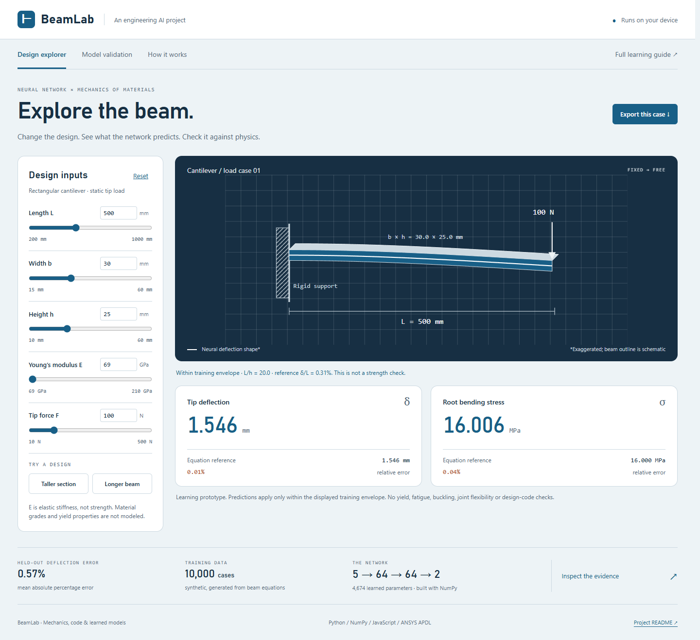

# BeamLab — a neural network for mechanical engineering

A working engineering portfolio project: a neural network predicts the tip
deflection and root bending stress of a rectangular cantilever. Change five
design inputs in the browser, compare predictions with mechanics equations,
inspect test errors, and export a case.

[Live demo](https://cowelljoshua.github.io/beamlab/) ·
[Beginner guide](https://cowelljoshua.github.io/beamlab/docs/BEGINNER_GUIDE.html) ·
[Source repository](https://github.com/cowelljoshua/beamlab)

**Start the demo:** open `index.html` in a browser. It works offline, with no
installation or backend. The trained model is already included.



**New to AI?** Read [the beginner guide](docs/BEGINNER_GUIDE.md), then use the
demo's **How it works** view. See [portfolio preparation](docs/PORTFOLIO.md) for
resume wording, a 90-second demo and interview questions.

## What is real

- NumPy implementation of forward propagation, backpropagation and Adam; no
  prebuilt neural-network training API. Architecture: **5 → 64 → 64 → 2**.
- **10,000 synthetic equation-generated cases**, with 6,000 training, 2,000
  validation and 2,000 test cases. No ANSYS data was used for training.
- Frozen seeds, train-only preprocessing, validation-selected checkpoint,
  a linear baseline, per-output error metrics and all test predictions.
- **18 completed ANSYS 2026 R1 solves**: six cases at 4, 8 and 16 BEAM188 elements,
  including support-reaction checks. See [verification data](reports/ansys_verification.json).
- JavaScript runs the saved weights in the browser. Tests compare its output
  with NumPy to an absolute tolerance of 1e-9.

## Measured held-out performance

| Output | Mean absolute % error | 95th percentile % error | Worst % error | R² |
|---|---:|---:|---:|---:|
| Tip deflection | 0.57% | 1.53% | 10.49% | 0.99992 |
| Root bending stress | 0.40% | 1.24% | 10.07% | 0.99995 |

These errors are relative to the synthetic analytical labels, not experiments.
They are not guaranteed error bounds. The network's maximum difference from
ANSYS across the six verification designs was 1.48% for deflection and 1.21%
for bending stress. The largest ANSYS deflection difference from the equation
was 0.54%; BEAM188 includes transverse shear and the labels do not.

**Engineering judgment:** closed-form equations are faster, simpler and exact
under this problem's assumptions. A log-input linear model could also recover
these power laws. The value of this project is demonstrating a verified
surrogate-model workflow, not claiming AI improves a simple beam formula.

## Reproduce the training

Python 3.12 and NumPy 2.4.4 were used. Node.js is only needed for the JS test.
No GPU, cloud service, training-data download or ANSYS license is needed to train.

```powershell
python -m venv .venv
.\.venv\Scripts\python -m pip install -r requirements.txt
.\.venv\Scripts\python train.py
.\.venv\Scripts\python -m unittest discover -s tests -v
node tests/test_browser_model.cjs
```

The completed reference training run took about 23 seconds on this machine;
your time and floating-point results may vary. `train.py` replaces the saved
dataset, model and metrics, so save your experiment outputs before a rerun.
All defaults and random seeds are in source. The best validation checkpoint
was epoch 500. Test data was evaluated after that choice; no test-driven tuning.

Optional ANSYS reproduction (installed licensed MAPDL required):

```powershell
python ansys/verify.py --exe "C:/Program Files/ANSYS Inc/v261/ansys/bin/winx64/ANSYS261.exe"
```

To serve locally instead of opening the file:

```powershell
python -m http.server 8765 --bind 127.0.0.1
```

Open `http://127.0.0.1:8765`. See [deployment instructions](docs/DEPLOYMENT.md)
for GitHub Pages and portfolio embedding. No Supabase project is required.

## Repository map

| Path | Purpose |
|---|---|
| `beamnet/physics.py` | Units, equations, training envelope and data generation |
| `beamnet/network.py` | Neural-network math and optimizer |
| `train.py` | Split, preprocessing, training, selection and evaluation |
| `artifacts/model.json` | Actual learned weights and scaling constants |
| `data/dataset.npz` | Generated data and exact split indices |
| `web/core.js` | Browser inference and domain checks |
| `web/app.js` | Demo interaction and evidence views |
| `reports/metrics.json` | Metrics, loss history, seeds, worst cases and slices |
| `reports/test_predictions.csv` | All 2,000 held-out predictions |
| `ansys/verification.inp` | Reproducible APDL verification models |
| `docs/MODEL_CARD.md` | Assumptions, use limits and provenance |

## Scope

Straight prismatic rectangular beam; ideal fixed support; static end point
load; linear elasticity; small deflection; no self-weight. Inputs are positive
magnitudes. L/h must be at least 10, reference deflection/length at most 2%,
and reference bending stress at most 200 MPa. The latter is a data filter,
not a yield-strength or safety criterion. The UI withholds out-of-domain
predictions. No fatigue, buckling, plasticity, joints or code compliance.

## Sources

- [Purdue mechanics-of-materials beam deflection reference](https://www.purdue.edu/freeform/me323/wp-content/uploads/sites/2/2018/10/ME323_F18_Hw7_final.pdf).
- [ANSYS BEAM188 element reference](https://ansyshelp.ansys.com/public/views/secured/corp/v261/en/ans_elem/Hlp_E_BEAM188.html).
- [Adam optimizer paper](https://arxiv.org/abs/1412.6980).

Developed with AI assistance. Treat the code, experiments and explanations as
material to understand and extend before claiming independent authorship or
expertise. This project has no affiliation with or endorsement from GLE.
